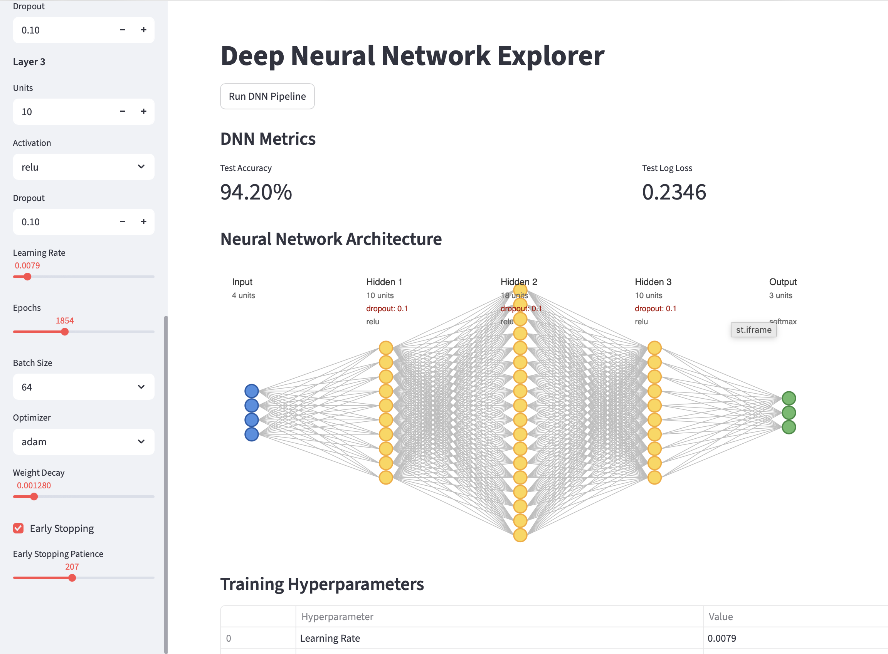
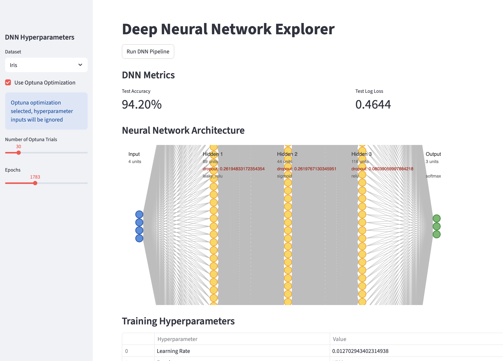
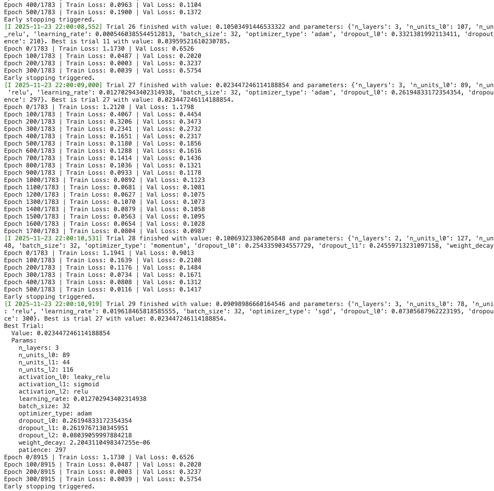

# Deep Neural Networks from Scratch 
> A hands-on deep learning project featuring a fully custom Python implementation "from scratch" of feedforward depp neural networks (MLPs), along with comparative TensorFlow and PyTorch versions for practice. 
The repository also includes Convolutional Neural Networks (CNNs) and Autoencoders.
They are trained on datasets such as Iris, MNIST (+95% accuraccy on those) and a small Cats vs Dogs vision task just for pratice (good accuracy only while using the MobileNetV2 model).
A Streamlit interface enables interactive experimentation with architectures and hyperparameters, making the project ideal for learning core neural network mechanics and modern DL workflows. 


#### Tables of contents
* [Path tree](#path-tree)
* [Direct links to folders](#direct-links-to-folders) 
* [Installation](#installation)
* [Overview of the DNN from scratch](#overview-of-the-dnn-from-scratch)
* [ML Pipeline workflow](#ml-pipeline-workflow)
* [Streamlit App](#streamlit-app)
* [Library tests](#library-tests)


## Path tree
```
Credit_and_Fraud_Prediction/
├── cat_dog_datasets/
├── computer_vision_with_libraries/
├── model_configs/
│   ├── iris/
│   └── mnist/
├── pictures/
├── test/
│   ├── iris/
│   └── mnist/
│
├── app.py
├── deepneuralnetworks.py
├── iris.py
├── main.py
├── mnist.py
├── README.md
└── requirements.txt
```


## Direct links to folders 
* [cat_dog_datasets](./cat_dog_datasets/) : datasets for computer vision practice
* [computer_vision_with_libraries](./computer_vision_with_libraries/) : TensorFlow & PyTorch & MobileNetV2 CNN implementations
* [model_configs](./model_configs/) : YAML configs generated by the Streamlit app
  * [iris](./model_configs/iris/) : Iris experiment configs
  * [mnist](./model_configs/mnist/) : MNIST experiment configs
* [pictures](./pictures/) : contains images used in the README file
* [test](./test/) : models testing both from scratch and with TensorFlow & PyTorch librairies (different levels of development)
  * [iris](./test/iris/) : models testing on the Iris dataset
  * [mnist](./test/mnist/) : models testing on the MNIST dataset


## Installation
1. Clone the project:
```
git clone git@github.com:tomcuel/Deep_Neural_Network_from_Scratch.git
cd Deep_Neural_Network_from_Scratch
```
2. Create a python virtual environment: 
```
python3 -m venv venv
source venv/bin/activate  # macOS / Linux
```
3. Install the requirements:
```
python3 -m pip -r requirements.txt
```
4. I used those librairies for this project: 
```py
import os
from math import *
import matplotlib.pyplot as plt
import numpy as np
from tqdm import tqdm
import h5py
from typing import List, Optional, Tuple
from dataclasses import dataclass
from sklearn.datasets import fetch_openml

from sklearn.model_selection import train_test_split, KFold
from sklearn.preprocessing import LabelEncoder, OneHotEncoder, StandardScaler, RobustScaler

import tensorflow as tf
from tensorflow.keras.applications import MobileNetV2
import torch
import torch.nn as nn
import torch.optim as optim
from torch.utils.data import TensorDataset, DataLoader

from functools import partial
import optuna

from sklearn.metrics import classification_report, accuracy_score, confusion_matrix, roc_auc_score, roc_curve, f1_score, precision_score, recall_score, mean_absolute_error, mean_squared_error, log_loss, r2_score, brier_score_loss, cohen_kappa_score, matthews_corrcoef
from sklearn.calibration import calibration_curve

import streamlit as st
```
5. Make sure to have Jupyter Notebook installed to run the `.ipynb` files


## Overview of the DNN from scratch
This project includes a fully custom Deep Neural Network (DNN) implementation written only with NumPy, featuring the complete training pipeline typically found in modern deep-learning frameworks.
The model supports MLP architectures with multiple activation functions, regularization features, and several optimizers.

**Key features** :
* **Flexible architecture**: define any number of layers, activation functions, dropout rates, and hidden sizes
* **Modern initialization & activations**: includes He/Xavier initialization and activations such as ReLU, LeakyReLU, Tanh, Sigmoid, and Softmax
* **Efficient forward pass with caching**:
  * Stores all intermediate values (Z, A, dropout masks, linear caches…)
  * Reuses cached values to avoid redundant computation
  * Dropout uses per-layer binary masks for efficient training-time regularization
* **Vectorized backward propagation**:
  * Fully vectorized gradients using cached matrices
  * Gradients flow through activations, dropout, and weight decay
  * Designed to minimize repeated computation and memory overhead
* **Optimizers** (maintaining their own cached state for efficient updates): SGD, Momentum, Adam (with bias correction)
* **Regularization**: L2 weight decay, Dropout applied per layer
* **Loss functions**: Cross-Entropy, Mean Squared Error (MSE)
* **Training workflow**: mini-batch gradient descent, batch shuffling, early stopping, optional loss plots, clear progress indicators
* **Predictions**: returns both predicted labels and class probabilities
* **Evaluation utilities**: built-in metrics for:
  * Accuracy, precision, recall, F1
  * Confusion matrix, ROC/AUC
  * Calibration curve
  * MAE, MSE, R2, Brier score
  * Extracting feature importances


## ML Pipeline workflow 
This project follows a standard end-to-end ML workflow:
1. Data preprocessing
2. Model definition (DNN from scratch with cache, dropout masks, and vectorized ops)
3. Hyperparameter tuning (manual or `Optuna`)
4. Training (mini-batches, early stopping, optimizers)
5. Evaluation (accuracy, loss, metrics)

#### CLI Usage
You can inspect all available command-line options using:
```
python iris.py -h
```
This displays:
```
usage: iris.py [-h] [-o] [-c CONFIG] [-e EPOCHS] [-t TRIALS] [-l LAYER_DIMS [LAYER_DIMS ...]] [-a ACTIVATIONS [ACTIVATIONS ...]] [-r LEARNING_RATE] [-b BATCH_SIZE] [-m OPTIMIZER_METHOD] [-d DROPOUT_RATES [DROPOUT_RATES ...]] [-w WEIGHT_DECAY] [-s EARLY_STOPPING] [-p PATIENCE] [-f PRINT_EVERY]

Iris Dataset Classification with DNN from Scratch

options:
  -h, --help            show this help message and exit
  -o, --optuna          Enable hyperparameter optimization with Optuna
  -c CONFIG, --config CONFIG
                        Path to YAML config file specifying hyperparameters
  -e EPOCHS, --epochs EPOCHS
  -t TRIALS, --trials TRIALS
                        Number of Optuna trials for hyperparameter optimization
  -l LAYER_DIMS [LAYER_DIMS ...], --layer_dims LAYER_DIMS [LAYER_DIMS ...]
  -a ACTIVATIONS [ACTIVATIONS ...], --activations ACTIVATIONS [ACTIVATIONS ...]
  -r LEARNING_RATE, --learning_rate LEARNING_RATE
  -b BATCH_SIZE, --batch_size BATCH_SIZE
  -m OPTIMIZER_METHOD, --optimizer_method OPTIMIZER_METHOD
  -d DROPOUT_RATES [DROPOUT_RATES ...], --dropout_rates DROPOUT_RATES [DROPOUT_RATES ...]
  -w WEIGHT_DECAY, --weight_decay WEIGHT_DECAY
  -s EARLY_STOPPING, --early_stopping EARLY_STOPPING
  -p PATIENCE, --patience PATIENCE
  -f PRINT_EVERY, --print_every PRINT_EVERY
```
If the hyperparameters option isn't filled, they will still be a default value depending on the dataset.

#### Config Files (`YAML`)
Instead of passing hyperparameters through the CLI every time, you can use a YAML file:

```yaml
activations:
- relu
- relu
- relu
batch_size: 64
dropout_rates:
- 0.1
- 0.1
- 0.1
early_stopping: true
epochs: 1854
layer_dims:
- 10
- 18
- 10
learning_rate: 0.0079
loss_function: cross_entropy
optimizer_method: adam
patience: 207
print_every: -1
weight_decay: 0.00128
```

#### Saving Results
After training, the pipeline automatically exports:

**Test metrics:**
```yaml
test_accuracy: 0.9420289855072463
test_log_loss: 0.46438833137945307
```

**Final model hyperparameters:**
(Manual tuning and Optuna produce different outputs)
```yaml
activations:
- leaky_relu
- sigmoid
- relu
- softmax
batch_size: 32
dropout_rates:
- 0.26194833172354354
- 0.2619767130345951
- 0.08039059997884218
early_stopping: true
epochs: 1783
layer_dims:
- 4
- 89
- 44
- 116
- 3
learning_rate: 0.012702943402314938
loss_function: cross_entropy
optimizer_method: adam
patience: 297
weight_decay: 2.2043110498347255e-06
```


## Streamlit App
Run the interactive UI with:
```
streamlit run app.py
```
1. **Manually configure the DNN**
- Add/remove layers dynamically
- Choose units, activations, dropout
- Tune learning rate, optimizer, patience, etc.
2. **Use Optuna hyperparameter optimization**
- Automatically searches for optimal architecture
- Produces a dedicated config in `config_optuna.yaml`:
```yaml
epochs: 1783
loss_function: cross_entropy
n_trials: 30
```
All configurations are saved in `model_configs/<dataset>/`

**UI Preview**
<table>
  <tr>
    <td style="text-align:center;">
      
      <br><b>Manual hyperparameter selection</b>
    </td>
    <td style="text-align:center;">
      
      <br><b>Optuna hyperparameter optimization</b>
    </td>
  </tr>
</table>

During optimization, the terminal shows the full Optuna trial logs:



## Library tests
Experiments were also conducted using **TensorFlow** and **PyTorch**, with progressively more advanced models as my understanding grew.
The same datasets (Iris, MNIST, Cats vs. Dogs) were used, allowing comparison with the DNN from scratch.

#### Iris & MNIST

I implemented several architectures:
* **DNN** (from Scratch, TensorFlow & PyTorch)
* **Autoencoders** for MNIST
* **CNN** for MNIST
Performance comparison on MNIST:
* **Best DNN from scratch**: 96.5%
* **Best TensorFlow DNN**: 97.7%
* **TensorFlow CNN**: > 99%

#### Small Computer Vision Task (Cats vs. Dogs, 1000 images)

As expected for such a small dataset, results were modest with basic models:
* PyTorch DNN: 51% 
* Tensorflow DNN: 56%
* Tensorflow CNN (and longer training time): 55%

To improve results, I **fine-tuned pre-trained models** (transfer learning) by adding a lightweight CNN head:
* **ResNet50**: 54% (too generic for the small/variable image sizes)
* **MobileNetV2**: 80% accuracy, the best-performing approach

